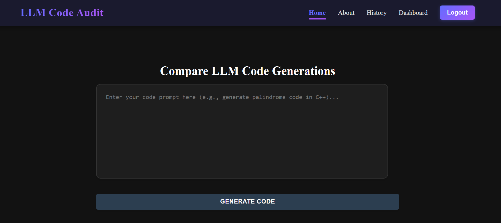
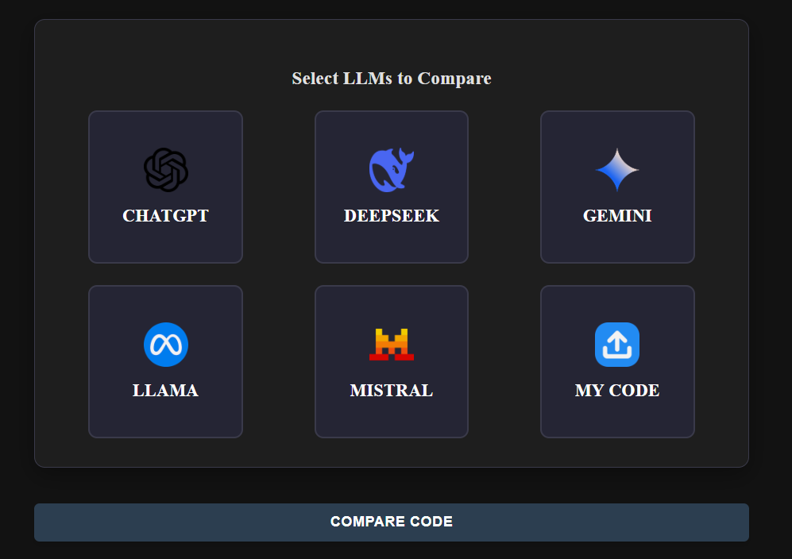
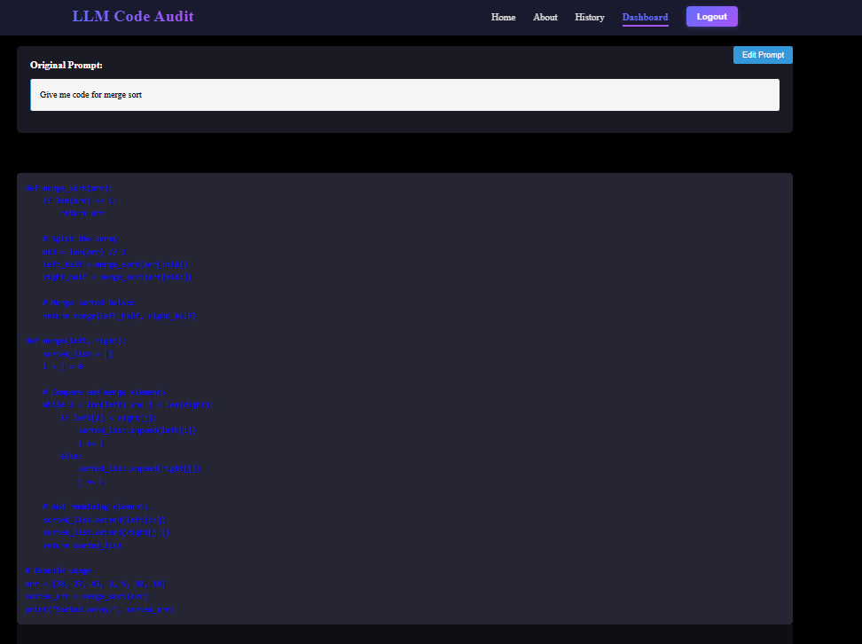
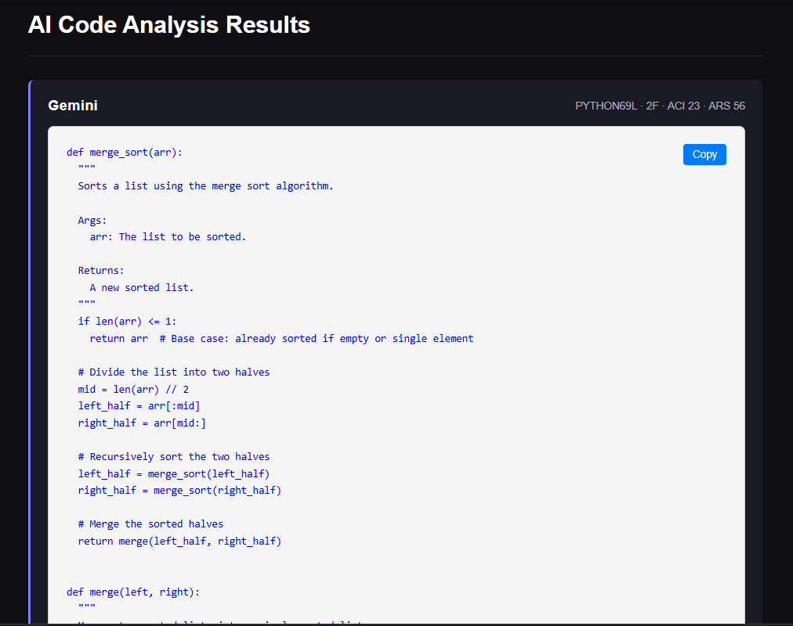
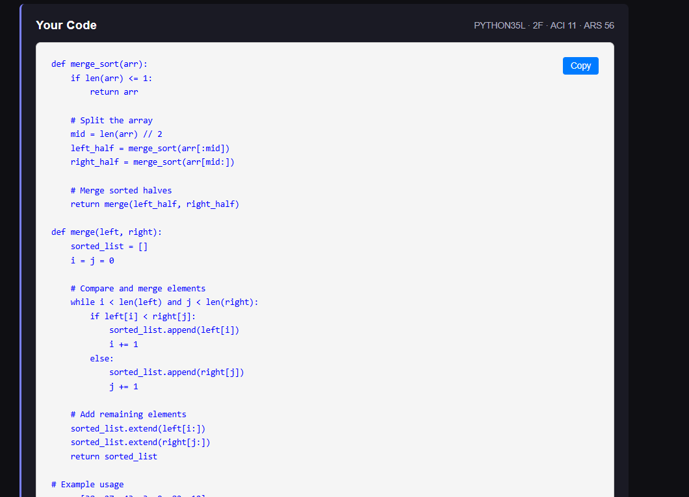
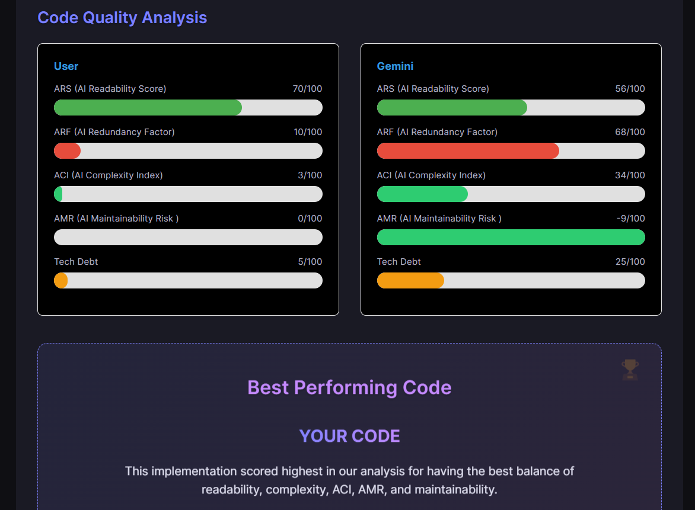
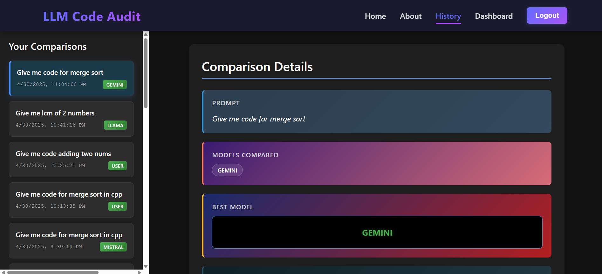

#  LLM Code Audit - Comprehensive Documentation
---
### 📌 Internship Project
This project was part of my **Summer Internship at Clover IT Services Pvt Ltd**.  
I was responsible for end-to-end design and development, including frontend (React + Vite), backend (Firebase + Firestore), and AI integrations (ChatGPT, Gemini, DeepSeek, LLaMA, Mistral).
---
### Link for the Live Website
https://multi-model-llm-code-audit.vercel.app/

**LLM Code Audit** is an intelligent, developer-focused tool designed to **generate, evaluate, and compare code** outputs from multiple Large Language Models (LLMs), including **ChatGPT**, **Gemini**, **DeepSeek**, **LLaMA**, and **Mistral**.

Whether you're prototyping, benchmarking, or auditing AI-generated code, this platform helps you make **data-driven decisions** by providing detailed metrics around code complexity, maintainability, and readability. 

With real-time analysis, visual dashboards, and history tracking, LLM Code Audit enables a transparent and measurable way to choose the best code output for your needs — all in a clean, user-friendly interface.


---

##  Table of Contents
1. [Introduction](#introduction)
2. [Problem Statement](#problem-statement)
3. [Solution Overview](#solution-overview)
4. [Features](#features)
5. [Technical Architecture](#technical-architecture)
6. [File Structure](#file-structure)
7. [Detailed Page Descriptions](#detailed-page-descriptions)
8. [Metrics Explanation](#metrics-explanation)
9. [Conclusion](#conclusion)
10. [Contributions](#contributions)

---

##  Introduction




**LLM Code Audit** helps developers analyze and compare code generated by multiple AI tools to identify the best-performing and most maintainable solution.

---

##  Problem Statement

###  The Problem
- AI-generated code is often unoptimized or poorly structured.
- Manually comparing outputs is tedious and error-prone.
- Lack of tools that provide actionable feedback and ranking across LLMs.


###  Why Current Tools Fall Short
- Tools like SonarQube evaluate only post-development.
- No side-by-side LLM comparisons.
- No automatic quality metrics or recommendations.

---

##  Solution Overview






**LLM Code Audit** provides:
-  Multi-LLM integration
-  AI code comparison
-  5 quality metrics
-  Scoring

---

##  Features

### 1.  Multi-LLM Code Generation
- One prompt → multiple AI outputs
- Side-by-side comparison
- Add user code for evaluation

### 2.  Advanced Code Analysis
- Detects code issues
- Auto-scores and recommends best output

### 3.  Smart Metrics System
- ACI (Complexity)
- AMR (Maintainability Risk)
- ARS (Readability)
- ADR (Dependency Risk)
- ARF (Redundancy)

### 4.  History Tracking

- Stores prompts and outputs
- Tracks best LLM per prompt
- Allows re-analysis

### 5.  User-Friendly Interface
- Minimal, modern UI
- Interactive visualizations
- Fully responsive

---

##  Technical Architecture

### Frontend
- React.js with Vite
- Modular components
- Styled using custom CSS

### Backend
- Firebase Authentication
- Firestore for prompt/output storage

### AI Integrations
- ChatGPT
- Gemini
- DeepSeek
- LLaMA
- Mistral

---

##  File Structure

```txt
node_modules/
public/
src/
├── api/
├── assets/
├── backend/
├── components/
│   ├── AuthModal.jsx
│   ├── Header.jsx
│   ├── HistoryItem.jsx
│   ├── QueryInput.jsx
│   └── ResultsDisplay.jsx
├── hooks/
├── pages/
│   ├── AboutPage.jsx
│   ├── AuthPage.jsx
│   ├── ComparisonDetail.jsx
│   ├── Dashboard.jsx
│   ├── HistoryPage.jsx
│   └── HomePage.jsx
├── styles/
├── App.css
├── App.jsx
├── firebaseConfig.js
├── firestoreService.js
├── index.css
├── main.jsx
.env
.gitignore
eslint.config.js
index.html
package-lock.json
package.json
vite.config.js

```

---

##  Detailed Page Descriptions

###  Home Page
- Enter prompt  
- Choose LLMs  
- Add custom code  
- Click "Generate" for outputs  

###  Dashboard Page
- View AI-generated code  
- Start code evaluation

###  Results Page
- Scores and charts for each output  
- Final recommendation  

###  History Page
- View and revisit previous prompts  
- Compare LLM performance over time  

###  About Page
- Project vision  
- Real-world applications  

---

##  Metrics Explanation

###  AI Complexity Index (ACI)
```mathematica
ACI = (0.5 × Cognitive Complexity) + (0.3 × Method Length) + (0.2 × Nesting Level)
```
### AI Maintainability Risk (AMR)
```mathematica
AMR = (0.4 × Code Smells per 100 LOC) + (0.4 × Duplication %) + (0.2 × % Uncommented Methods)
```
###  AI Readability Score (ARS)
```mathematica
ARS = (0.4 × Avg Line Length) + (0.4 × % Comments) + (0.2 × Naming Consistency)
```


##  Conclusion

**LLM Code Audit** empowers developers to take full control over AI-generated code, ensuring quality, maintainability, and clarity before integrating into production environments.

By offering clear comparisons, actionable insights, and in-depth metrics, this tool bridges the gap between rapid AI code generation and robust software engineering standards.

>  Ready to reduce tech debt and make AI code work for you?  
>  Try **LLM Code Audit** now!


